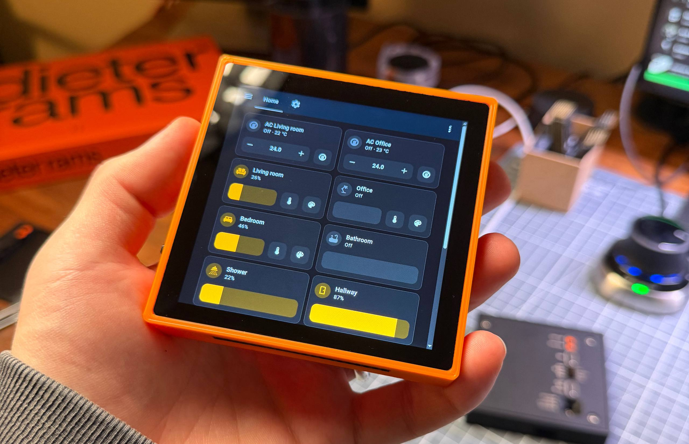

# Wall Panel

Wall Panel is a 4-inch wall-mounted touch display panel powered by Raspberry Pi Compute Module 4 (CM4). It features a 720x720 IPS multitouch display and can be used as a Home Assistant dashboard or any other embedded display application.

## Display
We use this [display](https://www.alibaba.com/product-detail/Square-4-Inch-IPS-LCD-Screen_1601124668163.html), but touch variant. It is 4 lane MIPI with i2c touch controller. 
- Display driver: ST7703
- Touch driver: FT6336U

## Possible use cases
- **Home Assistant Dashboard**. Perfect for wall-mounted smart home control panels with full touch interaction and high-resolution display.
- **Information Display**. Show weather, calendar, news, or any other dynamic content in your home or office.
- **Control Panel**. Use as a centralized control interface for IoT devices, lighting, or home automation systems.
- **Embedded Display**. Build custom applications using the full power of Raspberry Pi OS or any Linux distribution on the CM4.

## List of features
- **720x720 IPS Display** with multitouch support
- **Raspberry Pi Compute Module 4** as the main brain
- **External RTC** for accurate timekeeping
- **USB-C** for data and power
- **USB-OTG** support for device mode
- **Action Button** for user interaction
- **WiFi** connectivity
- **40-pin GPIO Header** for Raspberry Pi compatibility
- **SD Card** slot for storage expansion
- **Micro HDMI** output for external displays
- **EEPROM Flashing** capability for firmware updates
- **Backplane Connector** for power and data from the wall and future PoE backplate support

